# OTT Content Strategy Analyzer
### A Multi-Tool Data Analytics Project | Python • Excel • MySQL • Power BI

---

## Project Overview

This project analyzes 5,625+ real-time movie and TV show records collected from the TMDB API to identify content investment opportunities for OTT platforms targeting the Indian market.

The analysis frames a strategic question:
> **"Where should an OTT platform invest its content budget for maximum audience reach and quality?"**

Data was collected, cleaned, and analyzed across four tools — each chosen for what it does best.

---

## Tools & Technologies

| Tool | Purpose |
|------|---------|
| Python (pandas, requests) | API data collection & cleaning |
| Excel (Power Query, Pivot Tables) | Data cleaning & exploratory analysis |
| MySQL | Advanced querying & business insights |
| Power BI | Interactive dashboard & visualization |
| TMDB API | Real-time movie & TV show data source |

---

## Dataset

- **Source:** The Movie Database (TMDB) API
- **Collection method:** Paginated API calls (150 pages × 2 content types)
- **Movies:** 2,687 unique titles
- **TV Shows:** 2,938 unique titles
- **Total:** 5,625 titles across 40+ languages and 27 genres
- **Fields collected:** id, title, genres, release_date, original_language, popularity, vote_average, vote_count, content_type

---

## Project Structure

```
OTT-Content-Strategy-Analyzer/
├── 01_tmdb_data_collection.ipynb    # API collection & cleaning pipeline
├── ott_queries.sql                  # 8 MySQL business queries
├── OTT_Content_Analysis.xlsx        # Excel pivot table analyses (8 analyses)
├── OTT_Dashboard.pbix               # Power BI interactive dashboard (4 pages)
├── tmdb_movies_final.csv            # Cleaned movies dataset (2,687 rows)
├── tmdb_tvshows_final.csv           # Cleaned TV shows dataset (2,938 rows)
├── language_lookup.csv              # Language code to name reference table
├── screenshots/                     # Query results & dashboard pages
│   ├── query1_results.png
│   ├── query2_results.png
│   ├── query3_results.png
│   ├── query4_results.png
│   ├── query5_results.png
│   ├── query6_results.png
│   ├── query7_results.png
│   ├── query8_results.png
│   ├── page1_content_landscape.png
│   ├── page2_genre_performance.png
│   ├── page3_language_intelligence.png
│   └── page4_investment_recommendation.png
└── README.md
```

---

## Step 1 — Python: Data Collection Pipeline

**Why Python here:**
Python was used exclusively for API data collection and cleaning — the only task requiring programmatic HTTP requests and JSON parsing.

**What was built:**
- Authenticated connection to TMDB API v3
- Paginated collection loop (150 pages per content type)
- JSON parsing and field extraction
- Genre ID to name mapping (27 unique genres)
- Duplicate removal and column standardisation
- Export to CSV for downstream tools

**Key technical decisions:**
- `python-dotenv` used for secure API key storage — key never hardcoded in notebook
- `requests` library for HTTP calls with 0.3s politeness delay between pages
- Separate collection for movies and TV shows, then standardised column names
- `content_type` column added for unified downstream analysis

---

## Step 2 — Excel: Exploratory Analysis

**Why Excel here:**
Power Query's genre row-splitting and pivot table analyses are better suited for exploratory pattern discovery than SQL or Python.

**8 Pivot Table Analyses:**

| # | Analysis | Key Finding |
|---|---------|-------------|
| 1 | Avg Popularity by Genre (Movies) | Music, Horror, Sci-Fi lead popularity |
| 2 | Avg Vote Score by Genre (Movies) | Western, War, History most acclaimed |
| 3 | Content Volume by Year | 2026 record year, clear COVID dip in 2020 |
| 4 | Language Distribution % | English 71.7%, Indian languages only 2.55% |
| 5 | Genre Popularity Trend 2021–2025 | Fantasy, Animation, Adventure surging in 2025 |
| 6 | Sweet Spot Genres | Adventure, Animation, Music, Sci-Fi above median on both metrics |
| 7 | TV vs Movie Comparison | TV Shows average 2x more popular than Movies |
| 8 | Avg Popularity by Genre (TV Shows) | Western, Crime, Mystery dominate TV |

**Note on data pipeline design:**
Excel analyses used Power Query cleaned data with genres split into rows for pivot table analysis. SQL analyses used Python-cleaned CSVs with one row per title for accurate aggregations. Both derive from the same TMDB source. This reflects a deliberate tool-specific pipeline approach — a key lesson learned documented under Limitations.

---

## Step 3 — MySQL: Business Queries

**Why MySQL here:**
SQL handles complex filtering, window functions, JOINs and aggregations more efficiently than Excel for business questions requiring multi-condition logic.

**Database:** `ott_content_strategy`
**Tables:** `movies`, `tvshows`, `language_lookup`

**8 Business Queries:**

| # | Business Question | SQL Concepts Used |
|---|------------------|------------------|
| 1 | Top languages by popularity + quality | GROUP BY, JOIN, ROUND |
| 2 | High performing individual movies | Multi-condition WHERE |
| 3 | High performing individual TV shows | Multi-condition WHERE |
| 4 | Best release month for content performance | MONTH(), CASE WHEN |
| 5 | Languages punching above weight | HAVING clause |
| 6 | Indian language deep dive | IN(), MAX(), GROUP BY |
| 7 | Movies vs TV shows head to head | UNION ALL |
| 8 | Most engaging content across both formats | UNION ALL, ORDER BY |

### Query Results

**Query 1 — Top Languages by Popularity & Quality:**

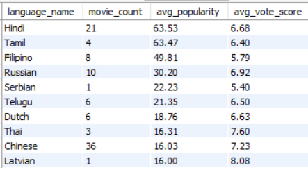

**Query 2 — High Performing Movies:**

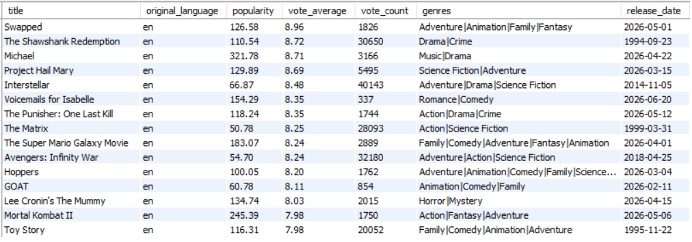

**Query 3 — High Performing TV Shows:**

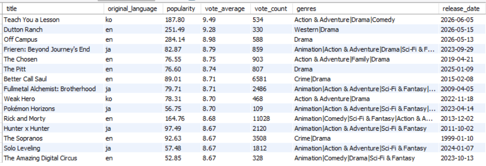

**Query 4 — Best Release Month:**

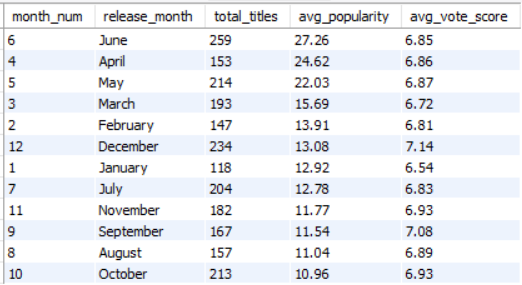

**Query 5 — Languages Punching Above Weight:**

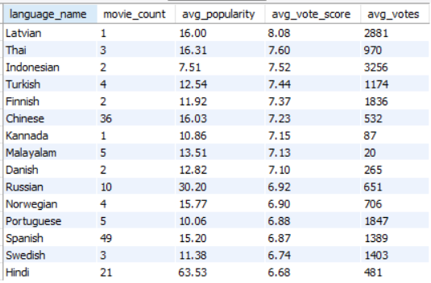

**Query 6 — Indian Language Deep Dive:**

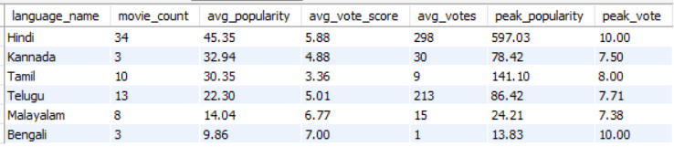

**Query 7 — Movies vs TV Shows Head to Head:**

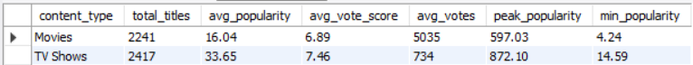

**Query 8 — Most Engaging Content Both Formats:**

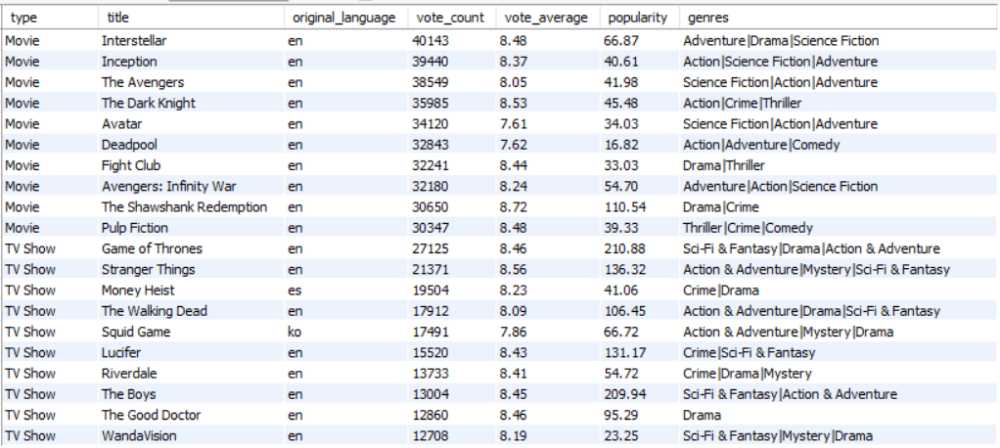

---

## Step 4 — Power BI: Interactive Dashboard

**Why Power BI here:**
Power BI's interactive slicers, DAX measures and relationship modelling enable dynamic exploration that static charts cannot provide.
**File:** `OTT_Dashboard.pbix` — open directly in Power BI Desktop.
Data sources are embedded. Refresh may require reconnecting to local CSV paths.

**4 Dashboard Pages:**

### Page 1 — Content Landscape
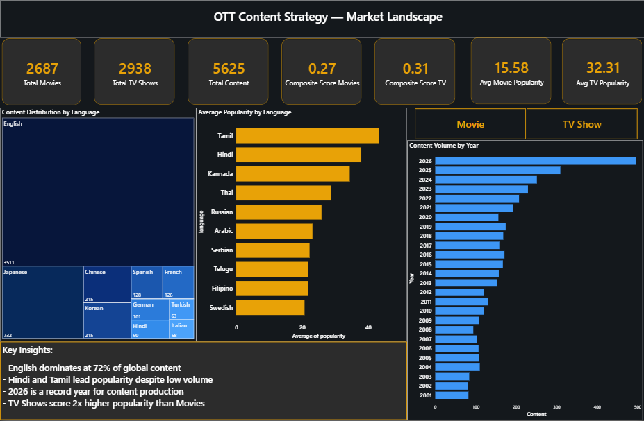

Overview of the OTT market — language distribution, content volume trends and format-level KPI comparison.

**Key visuals:**
- 7 KPI cards: total movies, TV shows, total content, composite scores, avg popularity by format
- Treemap: language distribution across all content
- Bar chart: top languages by average popularity
- Bar chart: content volume by year (2001–2026)
- Movie / TV Show slicer

---

### Page 2 — Genre Performance
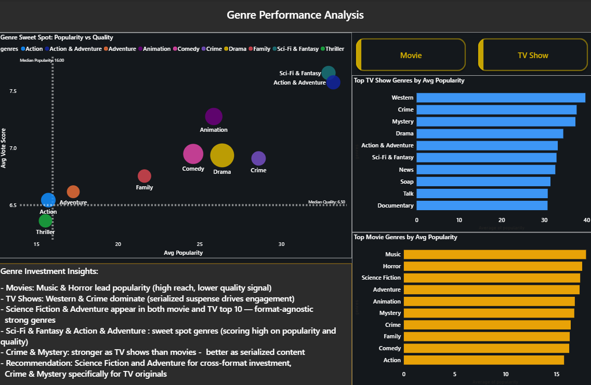

Genre-level investment analysis comparing movies and TV shows separately and combined.

**Key visuals:**
- Bar chart: top movie genres by average popularity
- Bar chart: top TV show genres by average popularity
- Scatter plot: popularity vs quality sweet spot (with quadrant reference lines)
- Content type slicer

---

### Page 3 — Language Intelligence
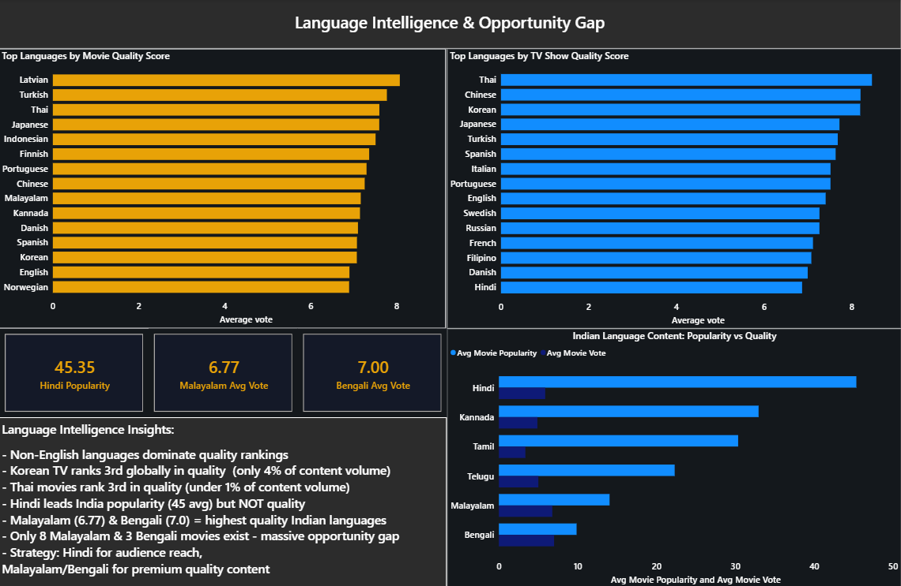

Language opportunity gap analysis with India-specific deep dive.

**Key visuals:**
- Bar chart: top 15 languages by quality score (movies)
- Bar chart: top 15 languages by quality score (TV shows)
- Grouped bar chart: Indian language performance — popularity vs quality
- 3 KPI cards: Malayalam quality, Hindi popularity, Bengali quality

---

### Page 4 — Investment Recommendation & Product Insights
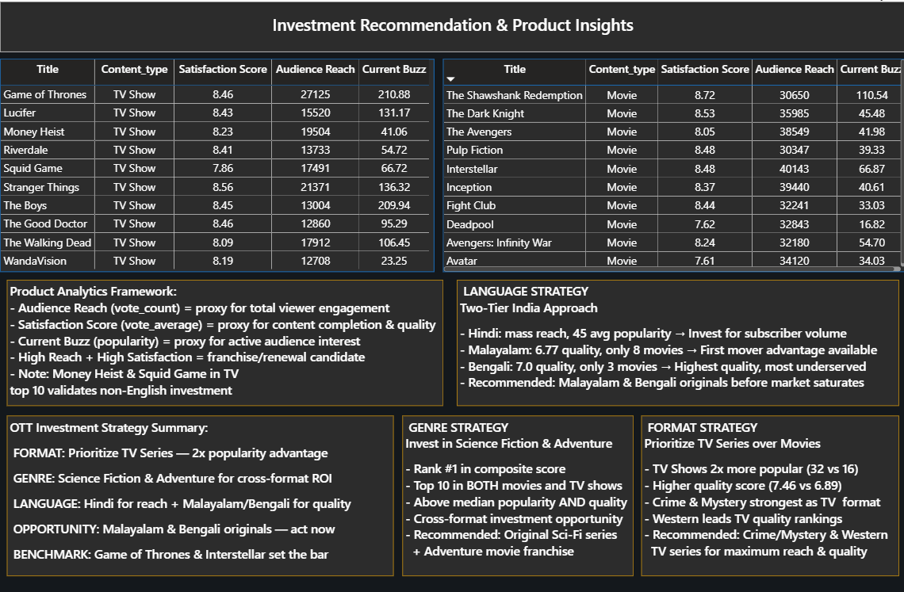

Data-backed strategic recommendations and product analytics framework.

**Key visuals:**
- 3 recommendation strategy cards (Genre, Language, Format)
- Table: top 10 high engagement movies (franchise candidates)
- Table: top 10 high engagement TV shows (franchise candidates)
- Product analytics framework explanation

**DAX Measures created:**
- Total Movies, Total TV Shows, Total Content
- Avg Movie Popularity, Avg TV Popularity
- Avg Movie Vote, Avg TV Vote
- Composite Score Movies, Composite Score TV
- Malayalam Avg Vote, Hindi Avg Popularity, Bengali Avg Vote

---

## Key Findings

### Genre Insights
- **Sweet spot genres:** Sci-Fi & Fantasy and Action & Adventure score above median on BOTH popularity and quality
- **TV dominance:** Crime, Mystery and Western perform significantly better as TV shows than movies
- **Movie leaders:** Music and Horror lead movie popularity but score lower on audience quality ratings
- **Animation:** Consistently strong across both formats — cross-format investment signal

### Language Insights
- **English dominates** volume (72%) but does NOT lead quality rankings
- **Malayalam** leads Indian language quality (6.77 avg vote) with only 8 movies — largest opportunity gap
- **Bengali** scores 7.0 quality with only 3 movies — highest quality Indian language overall
- **Korean and Japanese** consistently rank top 3 in quality across both movies and TV shows
- Indian languages combined (hi+te+ta+ml+bn) represent only ~2.55% of global content volume despite India being one of the world's largest film markets

### Format Insights
- **TV Shows average 2x more popular** than movies (32.31 vs 15.58 avg popularity)
- **TV Shows score higher quality** on average (7.46 vs 6.89 avg vote)
- **Movies generate deeper per-title engagement** — significantly more votes per title than TV shows
- Game of Thrones and Stranger Things lead TV engagement; Interstellar and Inception lead movie engagement

---

## Strategic Recommendations

Based on analysis of 5,625 titles across 40+ languages and 27 genres:

**1. FORMAT — Prioritise TV Series**
TV shows deliver 2x popularity and higher quality scores. Crime and Mystery genres specifically outperform as serialised TV format content.

**2. GENRE — Invest in Science Fiction & Adventure**
Both genres appear in the top 10 across movies AND TV shows. Above median on both popularity and quality — only genres with this dual signal.

**3. LANGUAGE — Two-Tier India Strategy**
- Hindi for mass reach and subscriber volume (45 avg popularity)
- Malayalam and Bengali for premium quality positioning (7.0 avg vote, critically underserved audiences)

**4. OPPORTUNITY — First Mover in Malayalam & Bengali**
Only 8 Malayalam and 3 Bengali movies exist in the global popularity-sorted dataset. Quality signal is strong — content investment infrastructure is not yet there. First mover advantage is available now.

---

## Limitations & Lessons Learned

**Data pipeline design:**
Excel and SQL used different data preparation approaches suited to each tool's strengths — Excel needed genre-level row splitting for pivot tables while SQL needed one row per title for accurate aggregations. In hindsight, defining tool-specific pipelines upfront before building analysis layers would have been cleaner. This is the primary lesson for future production environments.

**Genre analysis in SQL:**
SQL CASE-based genre assignment assigns each title to its first matching genre only — this underestimates genres appearing later in combined genre strings. Full genre analysis was conducted in Excel using proper Power Query row-splitting. SQL queries focused on language, format and title-level analysis where this limitation does not apply.

**TMDB data limitations:**
- Popularity scores reflect TMDB's current algorithmic scoring — not historical streaming viewership data
- Vote counts are a proxy for engagement, not equivalent to actual streaming view counts
- Dataset sorted by popularity — may underrepresent older or niche content in tail pages

**API access:**
TMDB is intermittently blocked by some Indian ISPs. Data collection required a VPN — a standard developer workaround that TMDB itself recommends on their forums. This does not affect the data or analysis quality.

---

## How to Reproduce

**1. Clone the repository:**
```bash
git clone https://github.com/Rehangv/ott-content-investment-analytics
cd ott-content-investment-analytics
```

**2. Get a free TMDB API key:**
- Register at [themoviedb.org](https://www.themoviedb.org)
- Go to Settings → API → Developer Plan (free, instant approval)

**3. Create a config.env file in the project folder:**
```
TMDB_API_KEY=your_api_key_here
```

**4. Install Python dependencies:**
```bash
pip install requests pandas python-dotenv mysql-connector-python
```

**5. Run the data collection notebook:**
```
01_tmdb_data_collection.ipynb
```

**6. Load data into MySQL:**
- Create database: `CREATE DATABASE ott_content_strategy;`
- Use the Python insertion script included in the notebook
- Run `ott_queries.sql` for all 8 business queries

**7. Open Power BI dashboard:**
- Open `OTT_Dashboard.pbix` directly in Power BI Desktop
- If data source errors appear: Transform Data → Data Source Settings → update CSV paths to your local folder
- All relationships and DAX measures are pre-configured
- All DAX measures are documented in the README above


---

## Author

**Rehan George Varghese**
Final Year CS Graduate | Targeting Product Analyst Roles | Mumbai, India

---

*Data source: The Movie Database (TMDB) API — used for personal, non-commercial portfolio purposes in accordance with TMDB's Developer Plan terms.*
